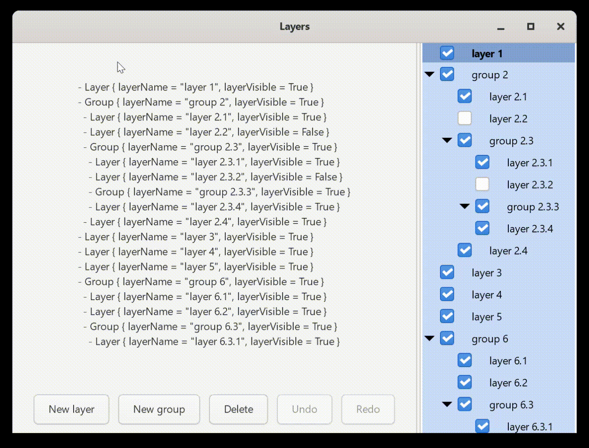

# `gtk-layers`

This project demonstrates how to use the `haskell-gi` GTK 4 bindings to
implement a system of layers, like one finds in typical image editing software
such as Photoshop, Inkscape or GIMP.

## Running

To run, clone the repository and run `cabal run exe:gtk-layers`.

This requires the GTK 4 C library to be installed, version 4.10 or above.
See the [`haskell-gi` repository](https://github.com/haskell-gi/haskell-gi)
for installation instructions for various platforms.

## Overview

The `gtk-layers` executable demonstrates various key implementation details of
a layer system in GTK:

  - The GTK 4 `TreeListModel` API (which replaces the now deprecated `TreeView`
    API), which separates the underlying model hierarchy from its visual display.  
    In particular, this shows:
      - how a `TreeListModel` can be edited by keeping references to underlying
        child list stores:
      - how to set up the `ListView` that displays the model, including what
        to do in the `setup` and `bind` signal handlers of the `SignalListItemFactory`
        which is used to create widgets that visualise the underlying data.

  - The GTK drag-and-drop API, which includes:
      - how to communicate Haskell data from the drag source to the drop target,
      - full CSS styling to animate the drag and drop effect,
      - updating the selection after a move operation.

  - Undo/redo functionality.

The code contains extensive comments that detail the implementation and justify
the approach taken.

## Acknowledgements

I extend my thanks to Iñaki García Etxebarria, the author and maintainer of the
`haskell-gi` library, for patiently help me diagnose and fix bugs in early
versions of this project.

